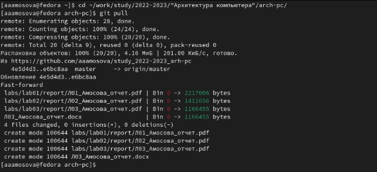
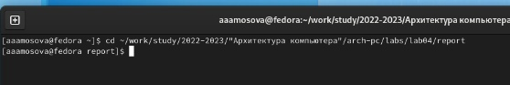
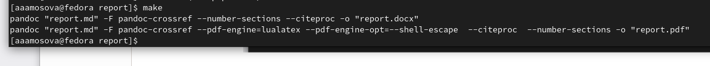
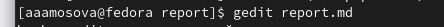
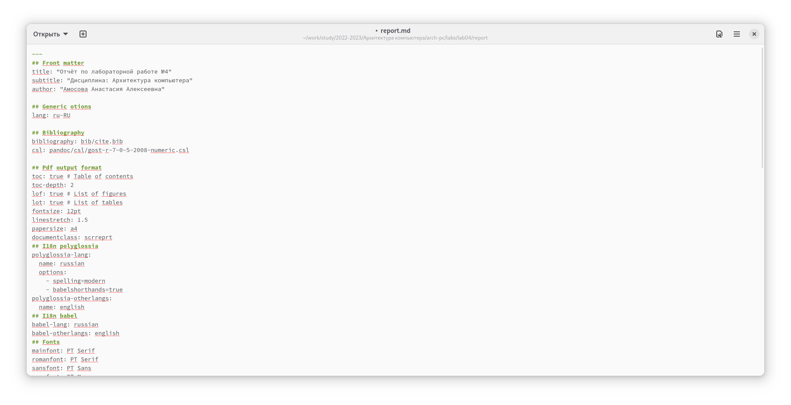

---
## Front matter
title: "Отчёт по лабораторной работе №4"
subtitle: "Дисциплина: Архитектура компьютера"
author: "Амосова Анастасия Алексеевна"

## Generic otions
lang: ru-RU

## Bibliography
bibliography: bib/cite.bib
csl: pandoc/csl/gost-r-7-0-5-2008-numeric.csl

## Pdf output format
toc: true # Table of contents
toc-depth: 2
lof: true # List of figures
lot: true # List of tables
fontsize: 12pt
linestretch: 1.5
papersize: a4
documentclass: scrreprt
## I18n polyglossia
polyglossia-lang:
  name: russian
  options:
	- spelling=modern
	- babelshorthands=true
polyglossia-otherlangs:
  name: english
## I18n babel
babel-lang: russian
babel-otherlangs: english
## Fonts
mainfont: PT Serif
romanfont: PT Serif
sansfont: PT Sans
monofont: PT Mono
mainfontoptions: Ligatures=TeX
romanfontoptions: Ligatures=TeX
sansfontoptions: Ligatures=TeX,Scale=MatchLowercase
monofontoptions: Scale=MatchLowercase,Scale=0.9
## Biblatex
biblatex: true
biblio-style: "gost-numeric"
biblatexoptions:
  - parentracker=true
  - backend=biber
  - hyperref=auto
  - language=auto
  - autolang=other*
  - citestyle=gost-numeric
## Pandoc-crossref LaTeX customization

## Misc options
indent: true
header-includes:
  - \usepackage{indentfirst}
  - \usepackage{float} # keep figures where there are in the text
  - \floatplacement{figure}{H} # keep figures where there are in the text
---

# Цель работы

Целью работы является освоение процедуры оформления отчетов с помощью легковесного языка разметки Markdown.

# Выполнение лабораторной работы

1)Для выполнения лабораторной работы установила всё необходимое программное обеспечение: Pandoc, pandoc-crossref и TeX Live.

2) Открываю терминал и перехожу в каталог курса, созданный при выполнении третьей лабораторной работы. Обновляю локальный репозиторий посредством команды git pull:
 
{ #fig:001 width=70% }
 
3) Перехожу в каталог, в котором находится шаблон отчёта по четвёртой лабораторной работе:

{ #fig:002 width=70% }

4) Провожу компиляцию с использованием Makefile, в результате генерируется два файла, корректность которых я проверяю:

{ #fig:003 width=70% }

Убедившись, что команда выполнена верно, удаляю полученные файлы.

5) После открываю файл report.md с помощью текстового редактора gedit:
 
{ #fig:004 width=70% }

Изучила его структуру.

{#fig:005 width=70%}

6) Заполнила отчёт, затем скомпилировала его с помощью Makefile. Проверила корректность полученных файлов.

7) Загрузила файлы на Github:

# Выводы

Благодаря данной лабораторной работе я научилась оформлять отчёты с помощью языка Markdown и установила необходимое для этого программное обеспечение.

